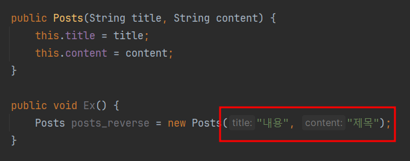

# feature1 게시글 생성, 조회, 수정 API 만들기
Spring Boot + JPA를 활용

## 주안점
* Domain 클래스 작성
* DTO 클래스를 이용한 Request
* 메세지 던지기 
* Builder패턴 (Setter X)

## Domain 클래스 작성 : Posts Entity
DB 테이블 구조를 쉽게 파악할 수 있습니다.

```java
@Getter
@NoArgsConstructor(access = PROTECTED)
@Entity
public class Posts {

    @Id
    @GeneratedValue(strategy = IDENTITY)
    private Long id;

    @Column(length = 500, nullable = false)
    private String title;

    @Column(columnDefinition = "TEXT", nullable = false)
    private String content;

    @Builder
    public Posts(String title, String content) {
        this.title = title;
        this.content = content;
    }
}
```
### 스키마 제약조건
대표적으로 `nullable`, `@Column` 등이 있습니다.
* `nullable`은 null 체크 기능으로 DB로 데이터를 insert 하는 시점에 확인합니다.
* `@Column`은 선언하지 않더라도 해당 클래스의 필드는 모두 컬럼으로 설정되고, 기본값 외 옵션 변경이 필요한 경우 사용을 합니다. 문자열의 경우, 기본값이 VARCHAR(255)인데 사이즈를 변경하고 싶은 경우에 `length`옵션을 사용하시면 됩니다.

### Builder 패턴
`@Builder` 애노테이션이 설정되어 있는 Posts 생성자 메소드를 통해서 객체를 생성할 수 있습니다. 빌더나 생성자나 Setter나 값을 채워주는 역할은 동일합니다. 빌더패턴을 적용하여 얻을 수 있는 장점은 아래와 같습니다.
1. **파라미터 순서와 상관없이 객체를 생성**할 수 있습니다.  
아래 그림은 생성자(빌더패턴X)를 통해 객체를 생성한 예시입니다. title과 content, 각 입력데이터의 순서가 바뀌게 된다면 코드가 실행되기전까지 문제를 찾을 수 없습니다.



2. **입력되는 파라미터값을 명확하게 지정**할 수 있습니다.
```java
Posts.builder()
        .title("title")
        .content("content")
        .build();
```

3. **하나의 생성자로 커버 가능**합니다.
테스트코드를 작성할때 객체를 여러개 만들어서 개발할때가 종종 있습니다. 이런 경우 수정할 필드값만 추가 또는 삭제하여 유연하게 대응할 수 있습니다.


## DTO 클래스를 이용한 Request

```java
@Getter
public class PostsSaveRequestDto {

    private final String title;
    private final String content;

    @Builder
    public PostsSaveRequestDto(String title, String content) {
        this.title = title;
        this.content = content;
    }

    public Posts toEntity() {
        return Posts.builder()
                .title(title)
                .content(content)
                .build();
    }
}
```
### Request DTO를 따로 관리해야하는 이유
Entity 클래스와 DTO 클래스를 보시면 코드가 매우 유사한 것을 파악하실 수 있습니다. 그럼 유지보수 측면에서 하나로만 관리하지 왜 DTO클래스를 따로 생성해서 관리하지? 하는 의문이 생기실 수 있는데요. 결론부터 말씀 드리자면 두 클래스는 `생성목적과 쓰임` 자체가 다릅니다.
* Entity 클래스 : 관계형 데이터베이스 테이블과 1:1로 매칭되는 클래스인만큼 오염이 되면 안됩니다. 가장 Core한 클래스이며 비지니스 로직을 포함한 수많은 서비스 클래스가 Entity클래스 기준으로 동작합니다.
* DTO 클래스 : 클라이언트 View를 위해 만들어졌으며 대표적으로 Request와 Response DTO를 사용합니다. 
> DB Layer와 View Layer는 철저하게 분리하는 것이 좋습니다. (by 향로)

### 메세지 던지기 
리팩토링 관점의 이야기입니다. 코드를 구현했을때 가독성이 높고 깔끔해야합니다. 아래 코드는 postsRepository에 DTO > Entity로 변환하여 저장만 해주면 됩니다. 
* 옵션1은 파라미터를 꺼내와서 객체를 새로 생성 및 가공해서 저장하는 방식
* 옵션2는 `dto.toEntity()` 메세지를 던지는 형식

한줄 코드로 가독성을 높이고, dto 클래스 내부에서 entity로 변환하면서 유지보수측면에서 좋은 코드라 볼 수 있겠습니다.

```java
@RequiredArgsConstructor
@RestController
public class WebRestController {

    private final PostsRepository postsRepository;

    @PostMapping("/posts")
    public void savePosts(@RequestBody PostsSaveRequestDto dto) {
        // Option1
        PostsSaveRequestDto request = new PostsSaveRequestDto(dto.getTitle(), dto.getContent());
        Posts toEntity = Posts.builder()
                .title(request.getTitle())
                .content(request.getContent())
                .build();
        postsRepository.save(toEntity);

        // Option2
//        postsRepository.save(dto.toEntity()); // 메세지 던지기
    }
}
```